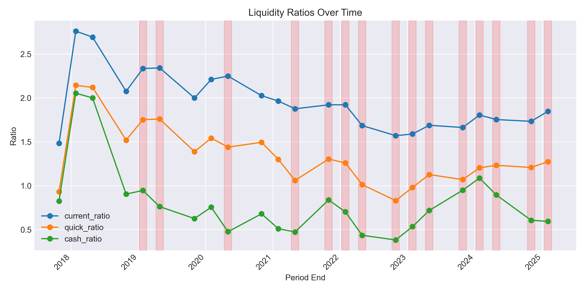
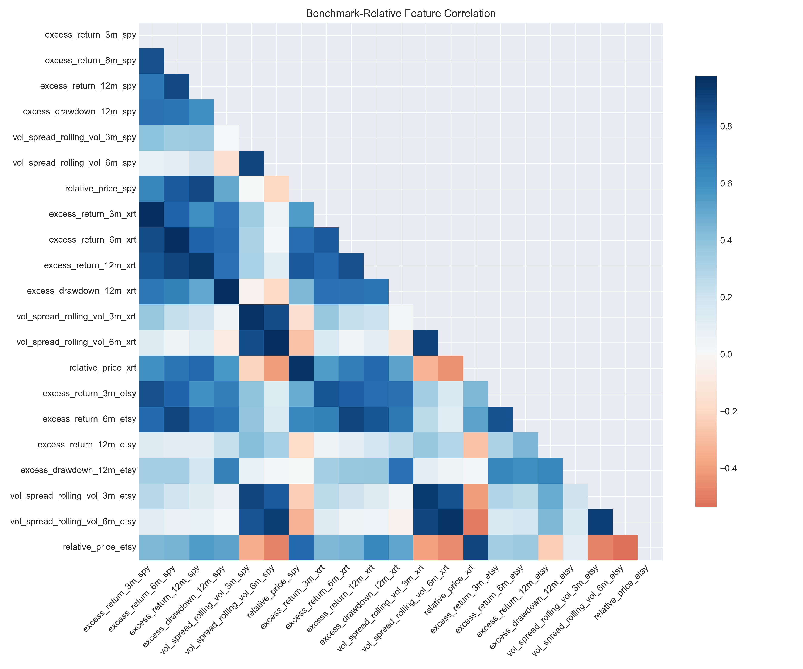
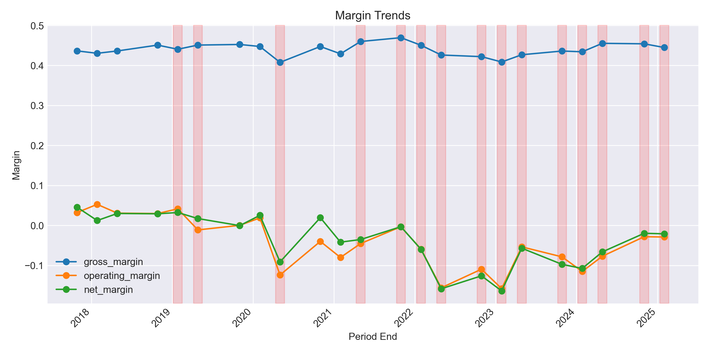
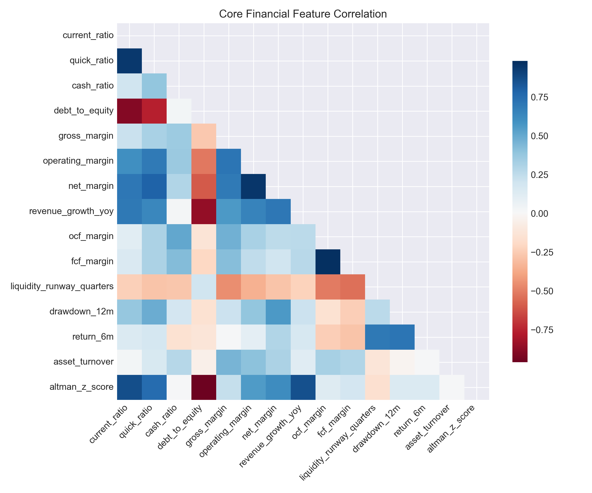

# Stitch Fix Distress Analysis (a.k.a. “How wobbly is SFIX right now?”)

This repo is my scratchpad for poking at Stitch Fix’s bankruptcy / distress risk. It leans on SEC XBRL filings, price history, and a couple of quick classifiers to see which signals shout “trouble ahead.”

## Project map

- `src/`
  - `config.py` – the knobs I keep twiddling (targets, thresholds, benchmark tickers).
  - `data_fetch.py` – pulls company facts + price history, with cranky fallbacks and caching.
  - `data_processing.py` – wrangles the SEC JSON into quarterly/annual panels.
  - `features.py` – computes liquidity/leverage/profitability ratios and fuses in market context.
  - `labeling.py` – rule-based distress flags that mix news windows, drawdowns, and Altman Z.
  - `eda.py` – quick-and-dirty plotting helpers (time-series, correlations, calibration).
  - `modeling.py` – logistic baseline + tree models with walk-forward evaluation.
  - `main.py` – glues everything together; run this when you want fresh data + plots.
- `data/raw/` – cached SEC JSON, price CSVs, and intermediate panels (handy when APIs sulk).
- `data/processed/` – engineered features and `sfix_model_ready_dataset.csv`.
- `reports/figures/` – PNGs: liquidity/margin/leverage trends, correlation grids, etc.
- `reports/model_metrics.json` – serialized metrics + feature importances per model.

## Quick start

```bash
pip install -r requirements.txt
python -m src.main
```

That run will:

1. Download or reuse SEC company facts for Stitch Fix.
2. Grab price history for SFIX plus benchmarks (SPY, XRT, ETSY) with a Stooq fallback if Yahoo rate-limits.
3. Build quarterly statements, engineer ratios, and attach benchmark-relative features (excess returns, vol spreads, relative price).
4. Generate distress labels (base, Altman-based, liquidity crunch) and shift them forward by `TARGET_LOOKAHEAD_PERIODS` so we’re predicting the future quarter.
5. Drop outputs into `data/processed/`, spin up plots (core vs. benchmark correlation heatmaps, time-series charts), and refresh calibration curves when class balance allows.
6. Train logistic regression, random forest, and histogram gradient boosting models using walk-forward splits and stash their metrics/feature weights in `reports/model_metrics.json`.

## Highlights (latest run)

- Walk-forward logistic regression (Altman target, 1-quarter lookahead) posts `f1=1.00` across all folds (class imbalance means ROC/AUPRC are undefined). Random forest and histogram GBM hover around `f1≈0.73` when the holdout finally gets a neutral class.
- Liquidity ratios keep sliding toward the 1.0 danger zone while Altman Z stays under 2.0 after FY22—visual proof below.
- Excess-return charts show SFIX badly lagging `SPY`/`XRT`, with peers like ETSY occasionally rebounding faster.

| Liquidity & margins | Benchmark comparison |
| --- | --- |
|  |  |
|  |  |

*(Images regenerate every `python -m src.main` run, so these stay current when new filings drop.)*

## Tweaks & experiments

- Update `DISTRESS_EVENTS`, `ALT_Z_THRESHOLD`, or liquidity thresholds to change labeling logic.
- Flip `PRIMARY_TARGET` between `target_distress_flag`, `target_altman_distress_flag`, or `target_liquidity_crunch_flag`.
- Adjust `TARGET_LOOKAHEAD_PERIODS` to predict two quarters out (or set to `0` for contemporaneous classification).
- Modify `BENCHMARK_TICKERS` if you want different peers/indices for relative metrics.
- Play with `WALK_FORWARD_*` to widen/narrow the rolling evaluation window.
- Expand `METRIC_TAGS` in `config.py` if SEC filings expose new GAAP line items worth tracking.
- Hack on `modeling.py` to add calibration, GBMs, survival models—whatever rabbit hole you’re in.
- The master dataset (`data/processed/sfix_model_ready_dataset.csv`) is notebook-friendly if you’d rather explore interactively.

> **Heads up:** Stitch Fix stayed distressed for long stretches (2023–2025), so later walk-forward folds still lack a clean negative class—ROC/AUPRC will read as `null`. Try alternative targets (e.g., revenue collapse, liquidity < 0.8) or longer lookahead windows if you need more balanced evaluation.
